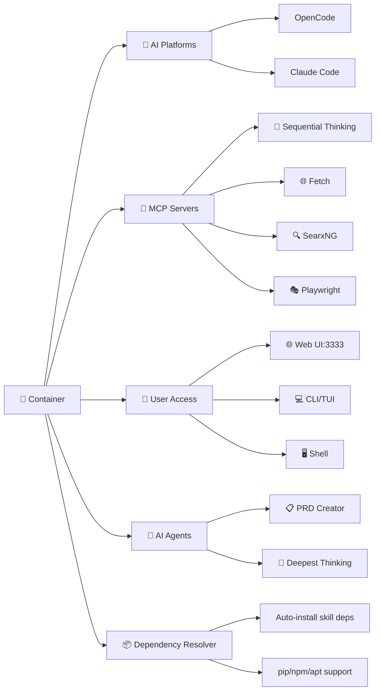

# Jeeves - Containerized AI Development Environment

[](https://www.docker.com/)
[](https://github.com/PowerShell/PowerShell)
[](https://github.com/SamAcctX/jeeves/blob/main/LICENSE)

> A sophisticated Docker-based development environment that containerizes OpenCode and Claude Code with pre-configured MCP servers and AI agents

## ✨ Key Features

- 🐳 **Containerized Environment** - Consistent, portable development setup with NVIDIA CUDA base image
- 🤖 **AI Platforms** - OpenCode with optional Claude Code support
- 🛠️ **Pre-configured MCP Servers** - Sequential Thinking, Fetch, SearxNG, Playwright
- 🎯 **Specialized AI Agents** - PRD Creator and Deepest-Thinking research agent
- 📦 **Automatic Dependency Resolution** - Skills' pip/npm/apt dependencies installed automatically
- 🌐 **Web UI Access** - Browser-based development at http://localhost:3333
- ⚡ **Cross-platform Support** - Windows, Linux, and macOS with proper file permissions

## 🚀 Quick Start

### Prerequisites
- **Docker Desktop** (Windows/Mac) or **Docker Engine** (Linux)
- **PowerShell 7.0+** for Windows, or **PowerShell Core** for cross-platform support
- **Git** for cloning repository
- **Sufficient disk space**: ~5GB recommended for container image

### Installation
```bash
# 1. Clone the repository
git clone https://github.com/SamAcctX/jeeves.git
cd jeeves

# 2. Build the Docker image
./jeeves.ps1 build

# 3. Start the container
./jeeves.ps1 start

# 4. Access your development environment
# Web UI: http://localhost:3333
# Terminal: ./jeeves.ps1 shell
```

### Verification
```bash
# Check container status
./jeeves.ps1 status

# Access the terminal for verification
./jeeves.ps1 shell

# Inside the container, verify installations
opencode --version

# If you built with --install-claude-code flag:
claude --version
```

## 📖 What is Jeeves?

Jeeves is a comprehensive development environment that combines the power of AI coding assistants with specialized tools and agents. It provides:

- **Unified AI Experience**: Seamlessly switch between OpenCode and Claude Code
- **Enhanced Capabilities**: MCP servers provide web search, browser automation, and structured reasoning
- **Specialized Agents**: AI assistants for product requirements and deep research
- **Production-Ready Setup**: Optimized configurations for serious development work

### Why Use Jeeves?

- 🔄 **Consistency**: Same environment across all machines
- 🚀 **Productivity**: Pre-configured tools and agents ready to use
- 📦 **Zero-Config Dependencies**: Skill dependencies installed automatically
- 🔒 **Privacy**: Local container with optional cloud AI services
- 🎯 **Focus**: Spend time coding, not configuring

## 🏗️ Architecture Overview



## 🎯 Features Deep Dive

### AI Agents

#### PRD Creator
Helps beginner developers create comprehensive Product Requirements Documents through structured questioning and technology recommendations.

**Usage:**
```bash
# Inside the container
@prd-creator
```

#### Deepest-Thinking
Conducts exhaustive research investigations using systematic methodology and academic-style reporting.

**Usage:**
```bash
# Inside the container
@deepest-thinking
```

### MCP Servers

#### Sequential Thinking
Structured analysis and reasoning tool for complex problem-solving.

#### Fetch Server
Web content retrieval and processing with automatic markdown conversion.

#### SearxNG
Privacy-focused web search capabilities with customizable search engines.

#### Playwright
Browser automation and web interaction for testing and scraping.

### Development Environment

- **Container Features**: NVIDIA CUDA base (Ubuntu 24.04) with modern Python/Node.js toolchain
- **OpenCode Integration**: CLI, TUI, and Web UI interfaces
- **Claude Code Support**: Dual platform capabilities with shared configuration
- **File Management**: Volume mounts for workspace and configuration persistence

## 📋 Usage Guide

### PowerShell Management Script

The `jeeves.ps1` script provides comprehensive container management:

| Command | Alias | Description | Example |
|---------|-------|-------------|---------|
| `build` | `b` | Build Docker image | `./jeeves.ps1 build --no-cache --desktop --install-claude-code` |
| `start` | `up` | Launch container | `./jeeves.ps1 start --clean` |
| `stop` | `down` | Stop container | `./jeeves.ps1 stop --remove --force` |
| `restart` | - | Restart container | `./jeeves.ps1 restart --no-cache --desktop --install-claude-code` |
| `shell` | `attach`, `sh` | Terminal access | `./jeeves.ps1 shell --new` |
| `rm` | `remove` | Remove container | `./jeeves.ps1 rm` |
| `logs` | `log` | View logs | `./jeeves.ps1 logs` |
| `status` | `st`, `ps` | Check status | `./jeeves.ps1 status` |
| `clean` | - | Cleanup | `./jeeves.ps1 clean` |

#### Interactive Mode
```powershell
# Run without arguments for interactive menu
./jeeves.ps1
```

#### Platform Requirements
- **Windows**: PowerShell 7.0+ (pre-installed on Windows 10+)
- **Linux/macOS**: Install PowerShell Core:
  ```bash
  # Ubuntu/Debian
  sudo apt-get update && sudo apt-get install -y powershell
  
  # macOS
  brew install powershell
  ```

### Development Workflows

#### Web UI Workflow
1. Start container: `./jeeves.ps1 start`
2. Open browser: http://localhost:3333
3. Use browser-based development environment
4. Leverage AI assistance directly in browser
5. Switch between AI agents as needed

#### Terminal Workflow
1. Get shell access: `./jeeves.ps1 shell`
2. Work in `/proj` directory (mounted workspace)
3. Use OpenCode CLI/TUI commands
4. Access tmux sessions for persistent work
5. Utilize pre-installed development tools

**Shell Options:**
```bash
# Enter existing container (default)
./jeeves.ps1 shell

# Stop/remove current container and enter fresh instance
./jeeves.ps1 shell --new
```

**Environment Variables:**
- `DISABLE_TMUX=1` - Disable automatic tmux attachment when entering shell

#### Agent-Assisted Development
1. **PRD Creation**: Use `@prd-creator` for project planning
2. **Research Tasks**: Use `@deepest-thinking` for comprehensive investigation
3. **Code Development**: Leverage OpenCode/Claude Code AI
4. **Tool Integration**: Use MCP servers for enhanced functionality

## ⚙️ Configuration & Customization

### Docker Configuration

#### Custom Dockerfile
Modify `Dockerfile.jeeves` to add custom tools or dependencies:

```dockerfile
# Add your custom tools
RUN apt-get update && apt-get install -y \
    your-tool \
    && rm -rf /var/lib/apt/lists/*
```

#### Environment Variables
These environment variables are automatically configured by `jeeves.ps1` when starting the container:

**Playwright MCP:**
- `PLAYWRIGHT_MCP_HEADLESS=1` - Run browser in headless mode
- `PLAYWRIGHT_MCP_BROWSER=chromium` - Default browser
- `PLAYWRIGHT_MCP_NO_SANDBOX=1` - Disable browser sandbox
- `PLAYWRIGHT_MCP_ALLOW_UNRESTRICTED_FILE_ACCESS=1` - Allow file system access

**OpenCode:**
- `OPENCODE_ENABLE_EXA=false` - Disable Exa web search (uses SearXNG instead)

**GPU Support:**
- `NVIDIA_DRIVER_CAPABILITIES=all` - Enable all NVIDIA GPU capabilities
- `CUDA_VISIBLE_DEVICES=all` - Make all GPUs visible to container

**SearXNG:**
- `SEARXNG_URL` - Set this when running `install-mcp-servers.sh` to configure your SearxNG instance URL

### Agent Configuration

#### Installing Custom Agents
```bash
# Inside the container
install-agents.sh --global
```

#### Agent Templates
Create custom agents in `.opencode/agents/` or `.claude/agents/`:

**OpenCode Format:**
```yaml
---
description: "Your custom agent"
mode: subagent

permission:
  write: ask
  bash: ask
  webfetch: allow
  edit: deny
tools:
  read: true
  write: true
  grep: true
  glob: true
  bash: true
  webfetch: true
  question: true
  sequentialthinking: true
---
```

**Claude Code Format:**
```yaml
---
name: your-agent-name
description: "Your custom agent"
mode: subagent

permission:
  write: ask
  bash: ask
  webfetch: allow
  edit: deny
tools: Read, Write, Grep, Glob, Bash, Web, SequentialThinking, Question
model: inherit
---
```

### Skill Dependency Resolver

Jeeves automatically installs dependencies required by AI skills (pip packages, npm modules, and apt packages).

#### How It Works
When the container starts, the `install-skill-deps.sh` script automatically:
1. Discovers all installed skills (global and project-local)
2. Parses each skill's `SKILL.md` for dependency declarations
3. Categorizes packages by manager (apt, pip, npm)
4. Deduplicates packages across all skills
5. Installs everything with appropriate privileges

#### Supported Dependency Patterns
Skills can declare dependencies in three ways:

**Pattern 1: Dependencies Section**
```markdown
## Dependencies

- **pandoc**: `sudo apt-get install pandoc` (for text extraction)
- **docx**: `npm install -g docx` (for creating documents)
- **defusedxml**: `pip install defusedxml` (for XML parsing)
```

**Pattern 2: Installation Section**
```markdown
### Installation

```bash
pip install 'markitdown[all]'
```
```

**Pattern 3: Inline Comments**
```markdown
Requires: pip install pytesseract pdf2image
```

#### Manual Usage
```bash
# Install all skill dependencies (runs automatically on startup)
./install-skill-deps.sh

# Preview what would be installed without installing
./install-skill-deps.sh --dry-run

# Verbose output with detailed logging
./install-skill-deps.sh --verbose

# Parse a specific skill file to JSON
python3 /proj/jeeves/bin/parse_skill_deps.py --skill-path /path/to/SKILL.md
```

#### Package Managers
- **APT**: System packages installed with `sudo` (pandoc, libreoffice, tesseract)
- **PIP**: Python packages installed without sudo (defusedxml, markitdown[pptx])
- **NPM**: Node packages installed globally with `sudo` (docx, pptxgenjs, playwright)

#### Docker Safety
The script is designed for container startup:
- Always exits with code 0 (never blocks container start)
- Continues on individual package failures
- Reports all failures at the end for troubleshooting
- Safe to run multiple times (idempotent)

## 📜 Container Scripts Reference

The `jeeves/bin/` directory contains installation and utility scripts designed to run inside the Jeeves container. These scripts enhance your development workflow with MCP servers, AI agents, and project scaffolding.

### Quick Reference

| Script | Type | Purpose |
|--------|------|---------|
| [`install-mcp-servers.sh`](#install-mcp-serverssh) | Executable | Install MCP servers for OpenCode/Claude |
| [`install-agents.sh`](#install-agentssh) | Executable | Install PRD Creator and Deepest-Thinking agents |
| [`install-skill-deps.sh`](#install-skill-depssh) | Executable | Install skill dependencies (auto-runs on startup) |
| [`install-skills.sh`](#install-skillssh) | Executable | Install Agent Skills for document/N8N workflows |
| [`parse_skill_deps.py`](#parse_skill_depspy) | Executable | Parse SKILL.md files for dependencies |
| [`ralph-init.sh`](#ralph-initsh) | Executable | Initialize Ralph project scaffolding |
| [`ralph-loop.sh`](#ralph-loopsh) | Executable | Autonomous AI task execution loop |
| [`sync-agents.sh`](#sync-agentssh) | Executable | Sync agent configs from agents.yaml |
| [`apply-rules.sh`](#apply-ruless) | Executable | Apply rules from RULES.md files |
| [`ralph-paths.sh`](#ralph-pathssh) | Library | Path detection utilities |
| [`ralph-validate.sh`](#ralph-validatesh) | Library | Validation utilities |
| [`find-rules-files.sh`](#find-rules-filessh) | Library | Find RULES.md files in directory tree |

### Installation Scripts

#### install-mcp-servers.sh

Installs and configures MCP (Model Context Protocol) servers for OpenCode and Claude Code platforms.

**MCP Servers Installed:**
- 🧠 **Sequential Thinking** - Structured analysis and reasoning
- 🌐 **Fetch** - Web content retrieval with markdown conversion
- 🔍 **SearXNG** - Privacy-focused web search
- 🎭 **Playwright** - Browser automation and testing

**Usage:**
```bash
# Install to user scope (recommended)
install-mcp-servers.sh --global

# Preview installation without making changes
install-mcp-servers.sh --dry-run

# Full installation with preview
install-mcp-servers.sh --global --dry-run
```

**Environment:**
- `SEARXNG_URL` - Set before running to configure your SearXNG instance URL
- Prompts for URL if not set

**Configuration Locations:**
- OpenCode: `~/.config/opencode/opencode.json`
- Claude Code: `~/.claude.json` (global) or `.mcp.json` (project)

---

#### install-agents.sh

Installs PRD Creator and Deepest-Thinking agent templates for AI-assisted development.

**Agents Installed:**
- 📋 **PRD Creator** - Product Requirements Document creation assistant
- 🔬 **Deepest-Thinking** - Comprehensive research and investigation agent

**Usage:**
```bash
# Install all agents to user scope (recommended)
install-agents.sh --global

# Install only Deepest-Thinking agent
install-agents.sh --deepest

# Show help
install-agents.sh --help
```

**Installation Scopes:**
| Scope | OpenCode Path | Claude Code Path |
|-------|---------------|------------------|
| Project | `/proj/.opencode/agents/` | `/proj/.claude/agents/` |
| User | `~/.opencode/agents/` | `~/.claude/agents/` |

---

#### install-skill-deps.sh

Discovers skills, parses dependencies from SKILL.md files, and installs required packages. Runs automatically on container startup.

**Usage:**
```bash
# Install all skill dependencies (runs automatically on startup)
install-skill-deps.sh

# Preview what would be installed
install-skill-deps.sh --dry-run

# Verbose output with detailed logging
install-skill-deps.sh --verbose

# Combined options
install-skill-deps.sh -v -d
```

**Options:**
| Option | Description |
|--------|-------------|
| `-v, --verbose` | Enable detailed output |
| `-d, --dry-run` | Preview without installing |
| `-h, --help` | Show help message |

**Package Managers:**
- **APT**: System packages (pandoc, libreoffice, tesseract)
- **PIP**: Python packages (defusedxml, markitdown)
- **NPM**: Node packages (docx, pptxgenjs, playwright)

**Docker Safety:**
- Always exits with code 0 (never blocks container start)
- Continues on individual package failures
- Idempotent (safe to run multiple times)

---

#### install-skills.sh

Installs Agent Skills for Claude Code and OpenCode platforms, including document processing and N8N workflow development skills.

**Usage:**
```bash
# Install document processing skills
install-skills.sh --doc-skills

# Install N8N workflow development skills
install-skills.sh --n8n-skills

# Install to user scope
install-skills.sh --doc-skills --global

# Show help
install-skills.sh --help
```

**Doc Skills Installed:**
- `docx` - Word document processing
- `pdf` - PDF manipulation and extraction
- `xlsx` - Excel spreadsheet handling
- `pptx` - PowerPoint presentation creation
- `markitdown` - Markdown conversion utilities

**N8N Skills Installed:**
- 7 workflow development skills for N8N automation platform

---

### Utility Scripts

#### parse_skill_deps.py

Python script for parsing SKILL.md files to extract dependency declarations in JSON format.

**Usage:**
```bash
# Parse a specific skill file
python3 /proj/jeeves/bin/parse_skill_deps.py --skill-path /path/to/SKILL.md

# Specify output file
python3 /proj/jeeves/bin/parse_skill_deps.py \
  --skill-path /path/to/SKILL.md \
  --output deps.json

# Verbose output
python3 /proj/jeeves/bin/parse_skill_deps.py \
  --skill-path /path/to/SKILL.md \
  --verbose
```

**Options:**
| Option | Required | Description |
|--------|----------|-------------|
| `--skill-path` | Yes | Path to SKILL.md file |
| `--output` | No | Output JSON file path |
| `--verbose` | No | Enable detailed logging |

**Output Format:**
```json
{
  "apt": ["pandoc", "tesseract-ocr"],
  "pip": ["defusedxml", "markitdown[all]"],
  "npm": ["docx", "pptxgenjs"]
}
```

---

#### ralph-init.sh

Initializes Ralph project scaffolding with directory structure, configuration files, and agent templates.

**Usage:**
```bash
# Initialize Ralph in current project
ralph-init.sh

# Force overwrite existing files
ralph-init.sh --force

# Initialize only rules system
ralph-init.sh --rules

# Show help
ralph-init.sh --help
```

**Creates:**
```
.ralph/
├── config/
│   ├── agents.yaml
│   └── deps-tracker.yaml
├── tasks/
├── templates/
│   └── agents/
└── rules/
    └── RULES.md
```

---

#### ralph-loop.sh

Autonomous AI task execution loop for continuous task processing with Ralph agents.

**Usage:**
```bash
# Run with default settings (opencode, 10 iterations)
ralph-loop.sh

# Specify tool and max iterations
ralph-loop.sh --tool opencode --max-iterations 20

# Skip initial sync and run immediately
ralph-loop.sh --skip-sync

# Disable delay between iterations
ralph-loop.sh --no-delay

# Dry run (preview without execution)
ralph-loop.sh --dry-run
```

**Options:**
| Option | Default | Description |
|--------|---------|-------------|
| `--tool` | opencode | AI tool to use (opencode/claude) |
| `--max-iterations` | 10 | Maximum loop iterations |
| `--skip-sync` | false | Skip initial agent sync |
| `--no-delay` | false | Disable backoff delay |
| `--dry-run` | false | Preview without execution |

**Environment Variables:**
| Variable | Default | Description |
|----------|---------|-------------|
| `RALPH_TOOL` | opencode | Default AI tool |
| `RALPH_MAX_ITERATIONS` | 10 | Max iterations |
| `RALPH_BACKOFF_BASE` | 5 | Base backoff seconds |
| `RALPH_BACKOFF_MAX` | 60 | Max backoff seconds |
| `RALPH_MANAGER_MODEL` | - | Manager model override |

---

#### sync-agents.sh

Synchronizes agent model configurations from `agents.yaml` to individual agent files.

**Usage:**
```bash
# Sync all agents using default config
sync-agents.sh

# Specify tool platform
sync-agents.sh --tool opencode

# Show what would change without modifying
sync-agents.sh --dry-run

# Show current configuration
sync-agents.sh --show

# Specify custom config file
sync-agents.sh --config /path/to/agents.yaml
```

**Options:**
| Option | Description |
|--------|-------------|
| `-t, --tool TOOL` | Target platform (opencode/claude) |
| `-c, --config FILE` | Custom agents.yaml path |
| `-s, --show` | Display current configuration |
| `-d, --dry-run` | Preview without changes |
| `-h, --help` | Show help message |

**Environment Variables:**
- `RALPH_TOOL` - Default tool platform
- `AGENTS_YAML` - Default config file path

---

#### apply-rules.sh

Applies rules from RULES.md files to guide AI behavior.

**Usage:**
```bash
# Apply single rules file
apply-rules.sh /path/to/RULES.md

# Apply multiple rules files
apply-rules.sh rules/RULES.md tasks/RULES.md
```

---

### Library Scripts

These scripts are sourced by other scripts and provide utility functions. They are not intended to be run directly.

#### ralph-paths.sh

Path detection utilities for finding project roots, Ralph directories, and agent files.

**Functions:**
| Function | Description |
|----------|-------------|
| `find_project_root` | Locate project root directory |
| `find_ralph_dir` | Find .ralph directory |
| `find_task_dir` | Find tasks directory |
| `find_agent_file` | Locate agent file by name |
| `expand_path` | Expand relative paths to absolute |

---

#### ralph-validate.sh

Validation utilities for ensuring data integrity and file existence.

**Functions:**
| Function | Description |
|----------|-------------|
| `validate_task_id` | Validate task ID format |
| `validate_yaml` | Validate YAML file syntax |
| `validate_file_exists` | Check file exists |
| `validate_dir_exists` | Check directory exists |
| `validate_git_repo` | Verify git repository |

---

#### find-rules-files.sh

Utility for finding RULES.md files in directory tree.

**Functions:**
| Function | Description |
|----------|-------------|
| `find_rules_files` | Find all RULES.md files in tree |

---

### Common Workflows

**Initial Setup Inside Container:**
```bash
# Install MCP servers globally
install-mcp-servers.sh --global

# Install AI agents globally
install-agents.sh --global

# Initialize Ralph project (if using Ralph)
ralph-init.sh
```

**Skill Development:**
```bash
# Check skill dependencies
install-skill-deps.sh --dry-run --verbose

# Parse specific skill dependencies
python3 /proj/jeeves/bin/parse_skill_deps.py \
  --skill-path /proj/jeeves/Ralph/skills/git-automation/SKILL.md
```

**Ralph Automation:**
```bash
# Initialize and run autonomous loop
ralph-init.sh
sync-agents.sh --show
ralph-loop.sh --max-iterations 5
```

### MCP Server Configuration

#### Adding New MCP Servers
```bash
# Inside the container
install-mcp-servers.sh --global --dry-run
```

#### Manual Configuration

**OpenCode** - Edit `opencode.json`:
```json
{
  "mcp": {
    "sequentialthinking": {
      "type": "local",
      "command": ["npx", "-y", "@modelcontextprotocol/server-sequentialthinking"]
    }
  }
}
```

**Claude Code** - Edit `.mcp.json` (project) or `~/.claude.json` (global):
```json
{
  "mcpServers": {
    "sequentialthinking": {
      "command": ["npx", "-y", "@modelcontextprotocol/server-sequentialthinking"]
    }
  }
}
```

## 🔧 Advanced Topics

### Development & Debugging

#### Building from Source
```bash
# Rebuild with no cache
./jeeves.ps1 clean
./jeeves.ps1 build --no-cache

# Build with desktop applications
./jeeves.ps1 build --desktop

# Build with Claude Code installed (disabled by default)
./jeeves.ps1 build --install-claude-code

# Full build with all options
./jeeves.ps1 build --no-cache --desktop --install-claude-code
```

#### Build Options

| Flag | Description |
|------|-------------|
| `--no-cache` | Build without Docker layer cache (clean build) |
| `--clean` | Stop and remove existing container before building |
| `--desktop` | Include desktop binaries (Linux/Windows apps) |
| `--install-claude-code` | Install Claude Code in the container |

**Note:** Claude Code installation is disabled by default. Use `--install-claude-code` to include it.

#### Performance Optimization
- **Docker Memory**: Allocate 4GB+ in Docker Desktop settings
- **Storage**: Use SSD for better I/O performance
- **CPU**: Allocate 2+ cores for compilation tasks

#### Security Considerations
- Container runs as non-root user
- File permissions properly mapped via UID/GID
- Network isolation via Docker bridge
- No sensitive data in container image

### Integration & Automation

#### CI/CD Integration
```bash
# Example GitHub Actions workflow
- name: Test with Jeeves
  run: |
    ./jeeves.ps1 start
    docker exec jeeves bash -c "opencode run 'run tests'"
    ./jeeves.ps1 stop
```

#### Scripting Examples
```powershell
# Automated development workflow
./jeeves.ps1 start
docker exec jeeves bash -c "cd /proj && npm install && npm test"
./jeeves.ps1 stop
```

## 🤝 Contributing

We welcome contributions! Please see [CONTRIBUTING.md](https://github.com/SamAcctX/jeeves/blob/main/CONTRIBUTING.md) for guidelines.

### Development Setup
```bash
# Clone repository
git clone https://github.com/SamAcctX/jeeves.git
cd jeeves

# Create development branch
git checkout -b feature/your-feature-name

# Make changes and test
./jeeves.ps1 build --no-cache
./jeeves.ps1 start

# Submit pull request
git add .
git commit -m "Add your feature"
git push origin feature/your-feature-name
```

## 📚 Reference Documentation

- [Command Reference](docs/commands.md)
- [Configuration Reference](docs/configuration.md)
- [Troubleshooting](docs/troubleshooting.md)

## 🆘 Community & Support

- **Issues**: [GitHub Issues](https://github.com/SamAcctX/jeeves/issues)
- **Discussions**: [GitHub Discussions](https://github.com/SamAcctX/jeeves/discussions)
- **Documentation**: [Full Docs](https://github.com/SamAcctX/jeeves/tree/main/docs)

## 📄 License & Legal

This project is licensed under the GNU Affero General Public License v3.0 - see the [LICENSE](https://github.com/SamAcctX/jeeves/blob/main/LICENSE) file for details.

### Third-Party Licenses
- **OpenCode**: MIT License
- **Claude Code**: Commercial License (Terms of Service)
- **MCP Servers**: Various Open Source Licenses

---

**Built with ❤️ by the Jeeves team**

*Get productive instantly with AI-powered development in a container*