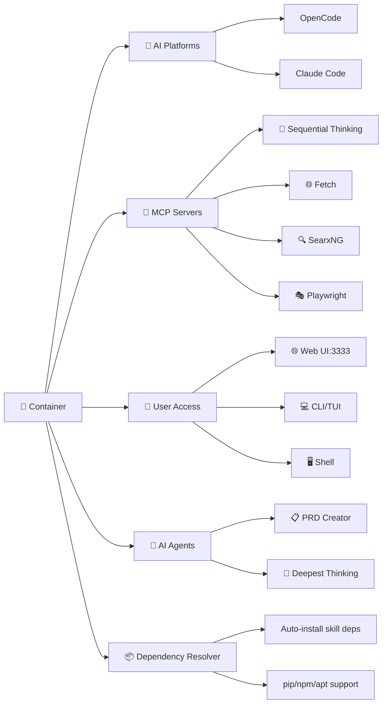

# Jeeves - Containerized AI Development Environment

[](https://www.docker.com/)
[](https://github.com/PowerShell/PowerShell)
[](https://github.com/SamAcctX/jeeves/blob/main/LICENSE)

> A sophisticated Docker-based development environment that containerizes OpenCode and Claude Code with pre-configured MCP servers and AI agents

## ✨ Key Features

- 🐳 **Containerized Environment** - Consistent, portable development setup with Ubuntu base
- 🤖 **AI Platforms** - OpenCode with optional Claude Code support
- 🛠️ **Pre-configured MCP Servers** - Sequential Thinking, Fetch, SearxNG, Playwright
- 🎯 **Specialized AI Agents** - PRD Creator and Deepest-Thinking research agent
- 📦 **Automatic Dependency Resolution** - Skills' pip/npm/apt dependencies installed automatically
- 🌐 **Web UI Access** - Browser-based development at http://localhost:3333
- ⚡ **Cross-platform Support** - Windows, Linux, and macOS with proper file permissions

## 🚀 Quick Start

### Prerequisites
- **Docker Desktop** (Windows/Mac) or **Docker Engine** (Linux)
- **PowerShell 7.0+** for Windows, or **PowerShell Core** for cross-platform support
- **Git** for cloning repository
- **Sufficient disk space**: ~5GB recommended for container image

### Installation
```bash
# 1. Clone the repository
git clone https://github.com/SamAcctX/jeeves.git
cd jeeves

# 2. Build the Docker image
./jeeves.ps1 build

# 3. Start the container
./jeeves.ps1 start

# 4. Access your development environment
# Web UI: http://localhost:3333
# Terminal: ./jeeves.ps1 shell
```

### Verification
```bash
# Check container status
./jeeves.ps1 status

# Access the terminal for verification
./jeeves.ps1 shell

# Inside the container, verify installations
opencode --version

# If you built with --install-claude-code flag:
claude --version
```

## 📖 What is Jeeves?

Jeeves is a comprehensive development environment that combines the power of AI coding assistants with specialized tools and agents. It provides:

- **Unified AI Experience**: Seamlessly switch between OpenCode and Claude Code
- **Enhanced Capabilities**: MCP servers provide web search, browser automation, and structured reasoning
- **Specialized Agents**: AI assistants for product requirements and deep research
- **Production-Ready Setup**: Optimized configurations for serious development work

### Why Use Jeeves?

- 🔄 **Consistency**: Same environment across all machines
- 🚀 **Productivity**: Pre-configured tools and agents ready to use
- 📦 **Zero-Config Dependencies**: Skill dependencies installed automatically
- 🔒 **Privacy**: Local container with optional cloud AI services
- 🎯 **Focus**: Spend time coding, not configuring

## 🏗️ Architecture Overview



## 🎯 Features Deep Dive

### AI Agents

#### PRD Creator
Helps beginner developers create comprehensive Product Requirements Documents through structured questioning and technology recommendations.

**Usage:**
```bash
# Inside the container
@prd-creator
```

#### Deepest-Thinking
Conducts exhaustive research investigations using systematic methodology and academic-style reporting.

**Usage:**
```bash
# Inside the container
@deepest-thinking
```

### MCP Servers

#### Sequential Thinking
Structured analysis and reasoning tool for complex problem-solving.

#### Fetch Server
Web content retrieval and processing with automatic markdown conversion.

#### SearxNG
Privacy-focused web search capabilities with customizable search engines.

#### Playwright
Browser automation and web interaction for testing and scraping.

### Development Environment

- **Container Features**: Ubuntu base with modern Python/Node.js toolchain
- **OpenCode Integration**: CLI, TUI, and Web UI interfaces
- **Claude Code Support**: Dual platform capabilities with shared configuration
- **File Management**: Volume mounts for workspace and configuration persistence

## 📋 Usage Guide

### PowerShell Management Script

The `jeeves.ps1` script provides comprehensive container management:

| Command | Alias | Description | Example |
|---------|-------|-------------|---------|
| `build` | `b` | Build Docker image | `./jeeves.ps1 build --no-cache --desktop --install-claude-code` |
| `start` | `up` | Launch container | `./jeeves.ps1 start --clean` |
| `stop` | `down` | Stop container | `./jeeves.ps1 stop --remove` |
| `restart` | - | Restart container | `./jeeves.ps1 restart --no-cache --desktop` |
| `shell` | `attach`, `sh` | Terminal access | `./jeeves.ps1 shell --new` |
| `logs` | - | View logs | `./jeeves.ps1 logs` |
| `status` | `st`, `ps` | Check status | `./jeeves.ps1 status` |
| `clean` | - | Cleanup | `./jeeves.ps1 clean` |

#### Interactive Mode
```powershell
# Run without arguments for interactive menu
./jeeves.ps1
```

#### Platform Requirements
- **Windows**: PowerShell 7.0+ (pre-installed on Windows 10+)
- **Linux/macOS**: Install PowerShell Core:
  ```bash
  # Ubuntu/Debian
  sudo apt-get update && sudo apt-get install -y powershell
  
  # macOS
  brew install powershell
  ```

### Development Workflows

#### Web UI Workflow
1. Start container: `./jeeves.ps1 start`
2. Open browser: http://localhost:3333
3. Use browser-based development environment
4. Leverage AI assistance directly in browser
5. Switch between AI agents as needed

#### Terminal Workflow
1. Get shell access: `./jeeves.ps1 shell`
2. Work in `/proj` directory (mounted workspace)
3. Use OpenCode CLI/TUI commands
4. Access tmux sessions for persistent work
5. Utilize pre-installed development tools

**Shell Options:**
```bash
# Enter existing container (default)
./jeeves.ps1 shell

# Stop/remove current container and enter fresh instance
./jeeves.ps1 shell --new
```

#### Agent-Assisted Development
1. **PRD Creation**: Use `@prd-creator` for project planning
2. **Research Tasks**: Use `@deepest-thinking` for comprehensive investigation
3. **Code Development**: Leverage OpenCode/Claude Code AI
4. **Tool Integration**: Use MCP servers for enhanced functionality

## ⚙️ Configuration & Customization

### Docker Configuration

#### Custom Dockerfile
Modify `Dockerfile.jeeves` to add custom tools or dependencies:

```dockerfile
# Add your custom tools
RUN apt-get update && apt-get install -y \
    your-tool \
    && rm -rf /var/lib/apt/lists/*
```

#### Environment Variables
Key environment variables in docker-compose:

```yaml
environment:
  - PLAYWRIGHT_MCP_HEADLESS=1
  - PLAYWRIGHT_MCP_BROWSER=chromium
  - PLAYWRIGHT_MCP_NO_SANDBOX=1
  - PLAYWRIGHT_MCP_ALLOW_UNRESTRICTED_FILE_ACCESS=1
  - OPENCODE_ENABLE_EXA=false
  - SEARXNG_URL=${SEARXNG_URL:-}
```

### Agent Configuration

#### Installing Custom Agents
```bash
# Inside the container
install-agents.sh --global
```

#### Agent Templates
Create custom agents in `.opencode/agents/` or `.claude/agents/`:

```yaml
---
description: "Your custom agent"
mode: subagent
temperature: 0.7
permission:
  write: ask      # ask | allow | deny
  bash: ask       # ask | allow | deny
  webfetch: allow # ask | allow | deny
tools: [read, write, grep, glob, bash, webfetch, question]
---
```

### Skill Dependency Resolver

Jeeves automatically installs dependencies required by AI skills (pip packages, npm modules, and apt packages).

#### How It Works
When the container starts, the `install-skill-deps.sh` script automatically:
1. Discovers all installed skills (global and project-local)
2. Parses each skill's `SKILL.md` for dependency declarations
3. Categorizes packages by manager (apt, pip, npm)
4. Deduplicates packages across all skills
5. Installs everything with appropriate privileges

#### Supported Dependency Patterns
Skills can declare dependencies in three ways:

**Pattern 1: Dependencies Section**
```markdown
## Dependencies

- **pandoc**: `sudo apt-get install pandoc` (for text extraction)
- **docx**: `npm install -g docx` (for creating documents)
- **defusedxml**: `pip install defusedxml` (for XML parsing)
```

**Pattern 2: Installation Section**
```markdown
### Installation

```bash
pip install 'markitdown[all]'
```
```

**Pattern 3: Inline Comments**
```markdown
Requires: pip install pytesseract pdf2image
```

#### Manual Usage
```bash
# Install all skill dependencies (runs automatically on startup)
./install-skill-deps.sh

# Preview what would be installed without installing
./install-skill-deps.sh --dry-run

# Verbose output with detailed logging
./install-skill-deps.sh --verbose

# Parse a specific skill file to JSON
python3 /proj/jeeves/bin/parse_skill_deps.py --skill-path /path/to/SKILL.md
```

#### Package Managers
- **APT**: System packages installed with `sudo` (pandoc, libreoffice, tesseract)
- **PIP**: Python packages installed without sudo (defusedxml, markitdown[pptx])
- **NPM**: Node packages installed globally with `sudo` (docx, pptxgenjs, playwright)

#### Docker Safety
The script is designed for container startup:
- Always exits with code 0 (never blocks container start)
- Continues on individual package failures
- Reports all failures at the end for troubleshooting
- Safe to run multiple times (idempotent)

### MCP Server Configuration

#### Adding New MCP Servers
```bash
# Inside the container
install-mcp-servers.sh --global --dry-run
```

#### Manual Configuration
Edit `opencode.json` (OpenCode) or `.claude.json` (Claude Code):

```json
{
  "mcp": {
    "servers": {
      "sequentialthinking": {
        "type": "local",
        "command": ["npx", "-y", "@modelcontextprotocol/server-sequential-thinking"]
      }
    }
  }
}
```

## 🔧 Advanced Topics

### Development & Debugging

#### Building from Source
```bash
# Rebuild with no cache
./jeeves.ps1 clean
./jeeves.ps1 build --no-cache

# Build with desktop applications
./jeeves.ps1 build --desktop

# Build with Claude Code installed (disabled by default)
./jeeves.ps1 build --install-claude-code

# Full build with all options
./jeeves.ps1 build --no-cache --desktop --install-claude-code
```

#### Build Options

| Flag | Description |
|------|-------------|
| `--no-cache` | Build without Docker layer cache (clean build) |
| `--desktop` | Include desktop binaries (Linux/Windows apps) |
| `--install-claude-code` | Install Claude Code in the container |

**Note:** Claude Code installation is disabled by default. Use `--install-claude-code` to include it.

#### Performance Optimization
- **Docker Memory**: Allocate 4GB+ in Docker Desktop settings
- **Storage**: Use SSD for better I/O performance
- **CPU**: Allocate 2+ cores for compilation tasks

#### Security Considerations
- Container runs as non-root user
- File permissions properly mapped via UID/GID
- Network isolation via Docker bridge
- No sensitive data in container image

### Integration & Automation

#### CI/CD Integration
```bash
# Example GitHub Actions workflow
- name: Test with Jeeves
  run: |
    ./jeeves.ps1 start
    docker exec jeeves bash -c "opencode run 'run tests'"
    ./jeeves.ps1 stop
```

#### Scripting Examples
```powershell
# Automated development workflow
./jeeves.ps1 start
docker exec jeeves bash -c "cd /proj && npm install && npm test"
./jeeves.ps1 stop
```

## 🤝 Contributing

We welcome contributions! Please see [CONTRIBUTING.md](https://github.com/SamAcctX/jeeves/blob/main/CONTRIBUTING.md) for guidelines.

### Development Setup
```bash
# Clone repository
git clone https://github.com/SamAcctX/jeeves.git
cd jeeves

# Create development branch
git checkout -b feature/your-feature-name

# Make changes and test
./jeeves.ps1 build --no-cache
./jeeves.ps1 start

# Submit pull request
git add .
git commit -m "Add your feature"
git push origin feature/your-feature-name
```

## 📚 Reference Documentation

- [Command Reference](docs/commands.md)
- [Configuration Reference](docs/configuration.md)
- [Troubleshooting](docs/troubleshooting.md)

## 🆘 Community & Support

- **Issues**: [GitHub Issues](https://github.com/SamAcctX/jeeves/issues)
- **Discussions**: [GitHub Discussions](https://github.com/SamAcctX/jeeves/discussions)
- **Documentation**: [Full Docs](https://github.com/SamAcctX/jeeves/tree/main/docs)

## 📄 License & Legal

This project is licensed under the GNU Affero General Public License v3.0 - see the [LICENSE](https://github.com/SamAcctX/jeeves/blob/main/LICENSE) file for details.

### Third-Party Licenses
- **OpenCode**: MIT License
- **Claude Code**: Commercial License (Terms of Service)
- **MCP Servers**: Various Open Source Licenses

---

**Built with ❤️ by the Jeeves team**

*Get productive instantly with AI-powered development in a container*